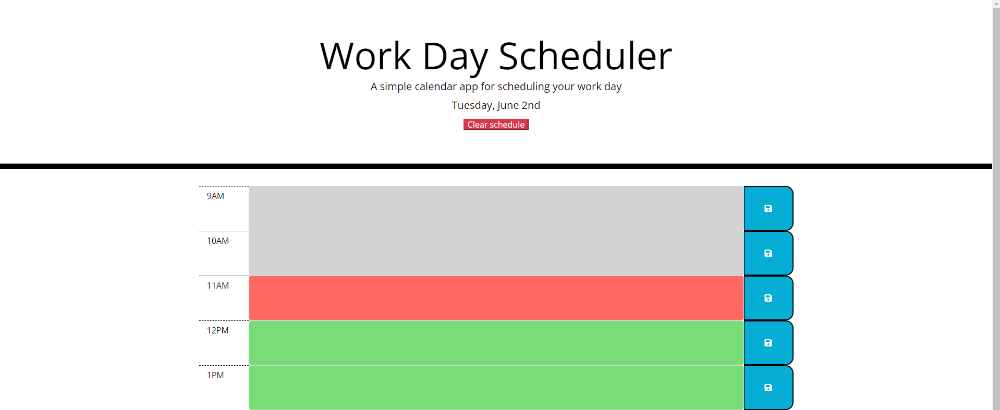

# Lucas-Saaler-Work-Planner

## Description

This is an hourly planner, which allows the user to organize a schedule for the day.

## Table of Contents (Optional)

- [Usage](#usage)
- [Credits](#credits)
- [License](#license)

## Usage

When you open the website, you will see a 9-5 schedule displayed in rows as well as the current date. Times that are in the past will be grey, the present will be red, and the future will be green. You may click any of these colored textboxes and input any text you want. Clicking the save buttons to the right will save whatever you input, so when next you load the page, the page will remember and display whatever you saved before. If you wish to clear your schedule completely, you may click the "Clear Schedule" button at the top of the page. Doing this will give you a confirmation pop-up, asking if you're sure you want to clear your schedule. If you click "OK", then the saved inputs and textboxes will be cleared. If you click "Cancel", nothing will happen, and your saved inputs will be retained.

## Credits

The template of index.html was provided by the Ohio State University online coding bootcamp, and the save icon was provided by Font Awesome. In making this website, I used jQuery and Bootstrap. I wrote everything else myself.

## License

